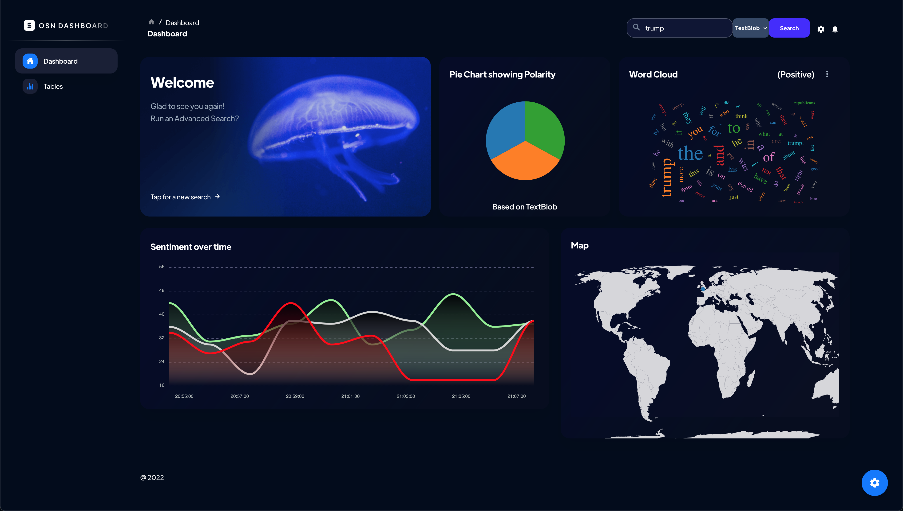

<h1 align="center">
   OSN Analysis Dashboard
  <br/>
</h1>
<p align="center">Twitter Sentiment Analysis Dashboard using #tag, words and username.

<p align="center"><a href="https://github.com/DiFronzo/OSN-analysis-dashboard/releases" target="_blank"></a>&nbsp;<a href="https://www.python.org/" target="_blank"></a>&nbsp;<a href="https://github.com/DiFronzo/OSN-analysis-dashboard/blob/main/LICENSE" target="_blank"></a>&nbsp;&nbsp;<a href="https://github.com/DiFronzo/OSN-analysis-dashboard/actions" target="_blank"></a></p>

## How to run the project?

### Local (Development)

#### Backend
1. Clone or download this repository to your local machine.
2. Install all the libraries mentioned in the requirements.txt file with the command `pip3 install -r backend/requirements.txt`
3. Create a file name `config.ini` in backend folder
4. Paste the code in `config.ini` and insert key details which you will get keys here [developer.twitter.com](https://developer.twitter.com/en)
```
[twitter]

api_key = Your Keys
api_key_secret = Your Keys
```
5. `$ python backend/app.py`
6. Visit http://127.0.0.1:5000/docs

#### Frondend
1. Install Node JS
2. `$ cd frondend`
3. `$ yarn install`
4. `$ npm start`
5. Visit http://localhost:3000

### 🐳 Docker and Docker Compose (Production)
We will use Docker Compose to manage the instance of web, cache (Radis), and API with the `docker-compose.yaml` file.

1. Clone or download this repository to your local machine.
2. Create a file name `config.ini` in backend folder
3. Paste the code in `config.ini` and insert key details which you will get keys here [developer.twitter.com](https://developer.twitter.com/en)
```
[twitter]

api_key = Your Keys
api_key_secret = Your Keys
```
cd into the top folder, and make a copy of `.env_example` to `.env`
```bash
$ cp .env_example .env
```

We can start the application with just one simple command:
```bash
$ docker-compose up
```

or run it in the background with this command, adding -d for detached mode

```bash
$ docker-compose up -d
```

And stop the application service running with

```bash
$ docker-compose down
```

* Backend: Visit http://localhost:5000/docs
* Frontend: Visit http://localhost:3000
